## Lab ARSW7 Parte 2

## Daniel Ricardo Ruge Gomez

### Laboratorio - Broker de Mensajes STOMP con WebSockets + HTML5 Canvas.

### Parte I.

#### 1.

Se completó el cliente JavaScript para que, además de dibujar los puntos localmente, los publique en el tópico /topic/newpoint mediante stompClient.send, y se agregó la suscripción al mismo canal para que cada cliente reciba y dibuje en tiempo real los puntos enviados por otros usuarios, logrando así la funcionalidad colaborativa del lienzo.

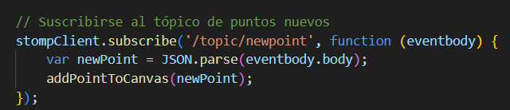

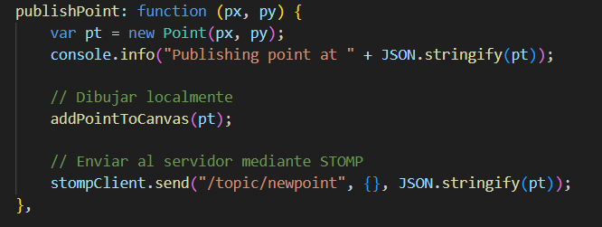

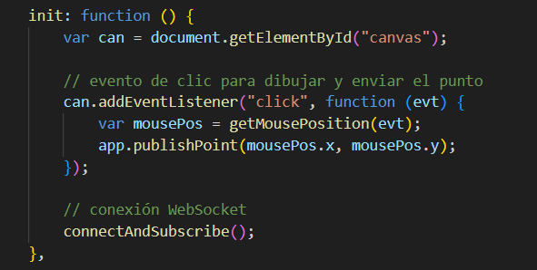

#### 2.

 modifique la función de conexión al WebSocket para que la aplicación se suscriba al tópico /topic/newpoint en lugar de /TOPICOXX. Además, se agregó un callback que, al recibir un mensaje, convierte su contenido (message.body) en un objeto JSON mediante JSON.parse, extrae las coordenadas X y Y, y muestra un mensaje de alerta con estos valores.

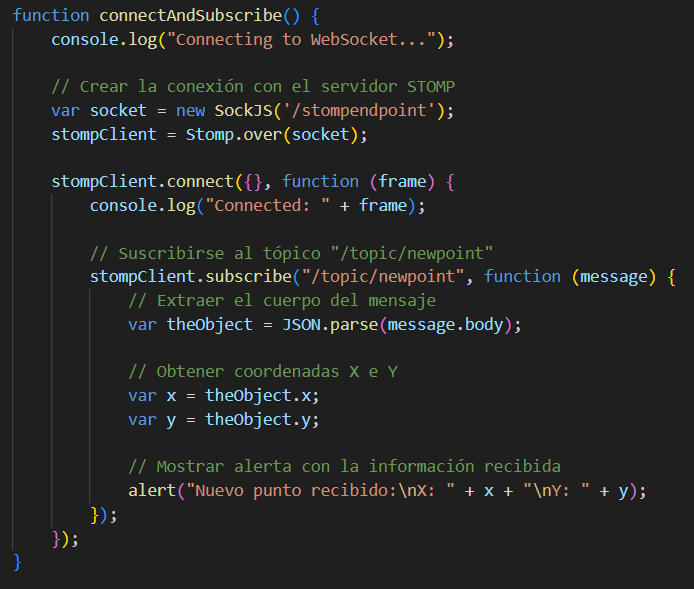

#### 3 , 4 y 5.

compile, ejecute y probe la aplicación en varias pestañas de navegadores diferentes y pude ver que en todas la pestañas se lanzo la alerta con los datos ingresados.

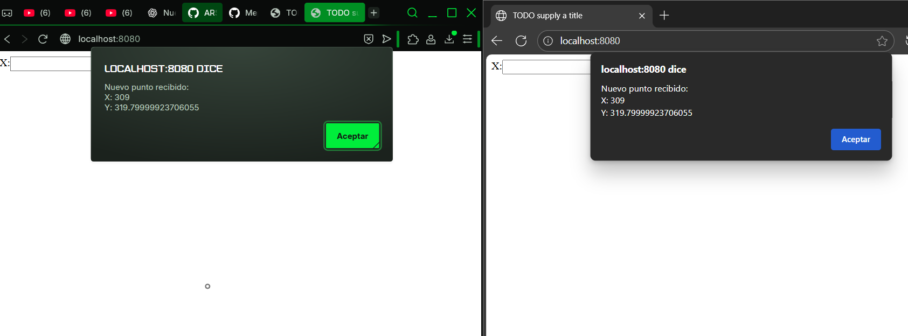

### Parte II.

#### 1.

Reemplace la línea del alert() por una llamada a addPointToCanvas(new Point(x, y));.
Ahora, cuando otro cliente publique un punto, automáticamente se dibuja en el canvas compartido

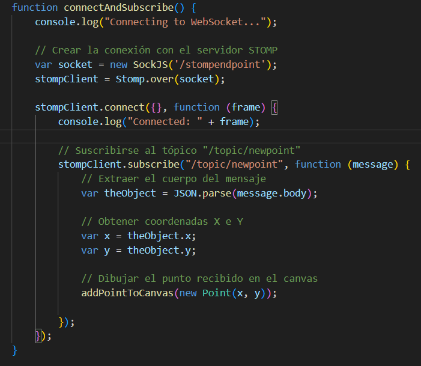

#### 2 y 3.

Verificamos que funciona 

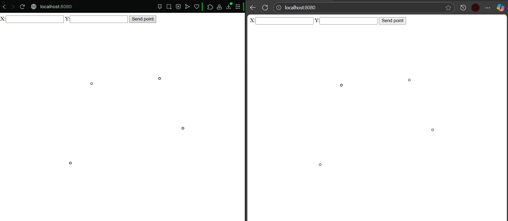

### Parte III.

#### 1.

agregué un campo en la vista para identificar el dibujo que se creara

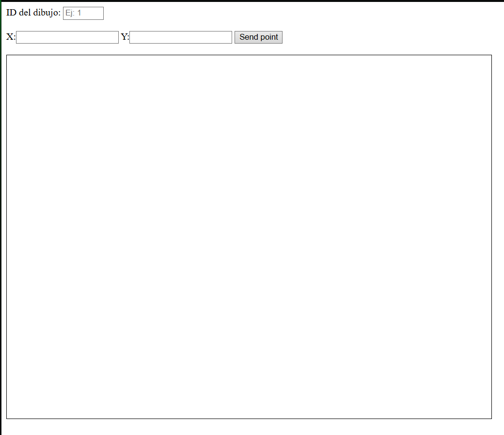

#### 2.

agregué el boton para conectarse y suscribirse a un tópico

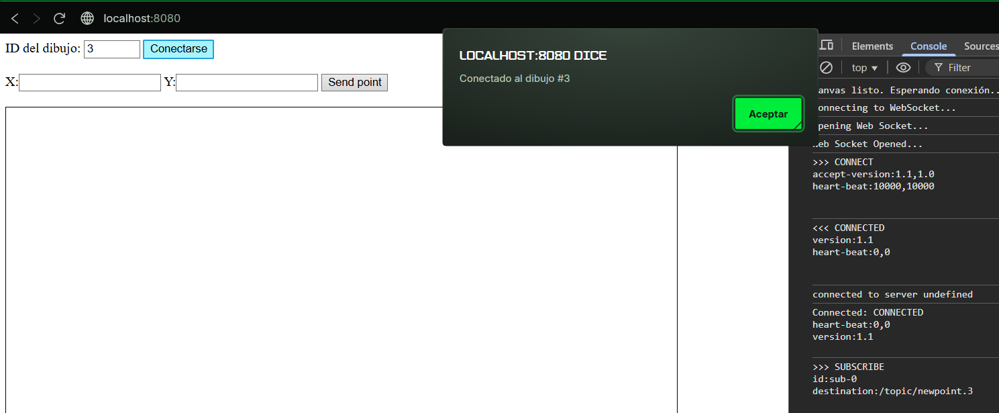

#### 3.

verificamos el nombre dinámico, asociado el identificador ingresado

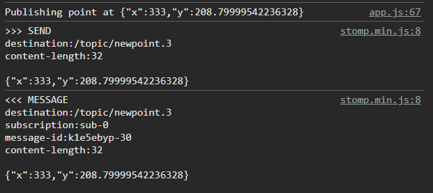

#### 4.

Verificamos que se puedan realizar dos dibujos de forma independiente

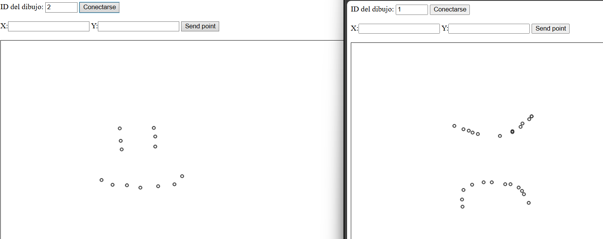

### Parte IV:

#### 1.

Creamos el controlador nuevo 

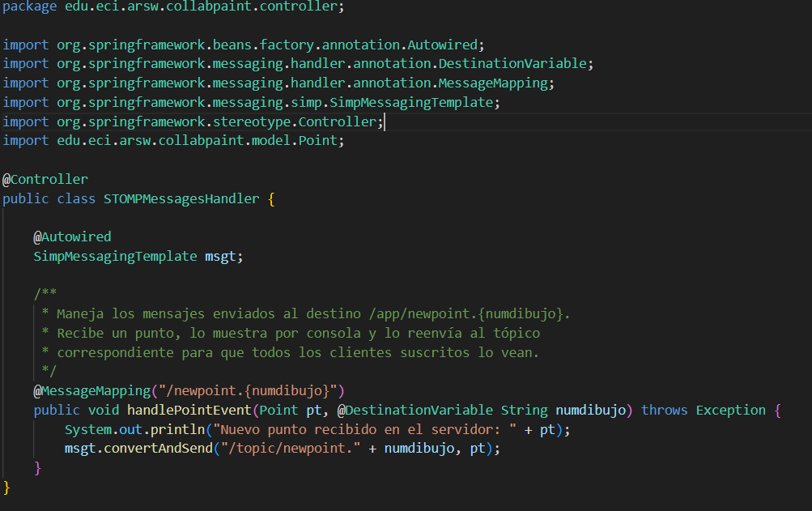

#### 2.

modificamos y verificamos que funcione igual

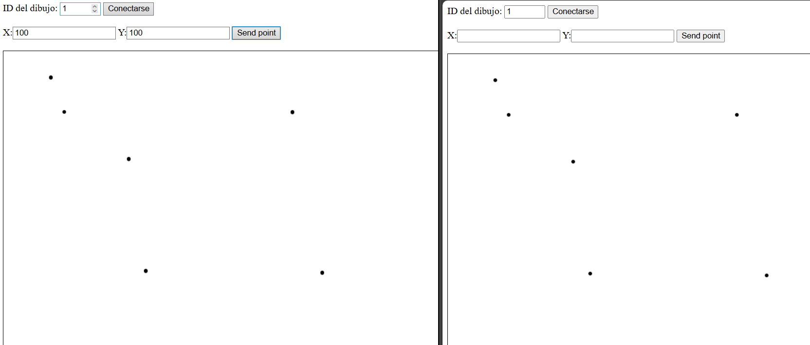

#### 3 4 y 5.

Se modificó el servidor para que, además de reenviar puntos individuales a /topic/newpoints.{id}, mantenga un buffer por dibujo y publique un polígono cada vez que se acumulen cuatro puntos, asegurando acceso concurrente seguro mediante sincronización por buffer. En el cliente, se ajustó la suscripción para escuchar tanto los puntos individuales como los polígonos en /topic/newpolygon.{id} y se implementó una función defensiva drawPolygon que dibuja correctamente los polígonos recibidos, garantizando compatibilidad con distintos formatos de payload y resolviendo problemas de visualización al recibir varios clientes conectados al mismo dibujo.

